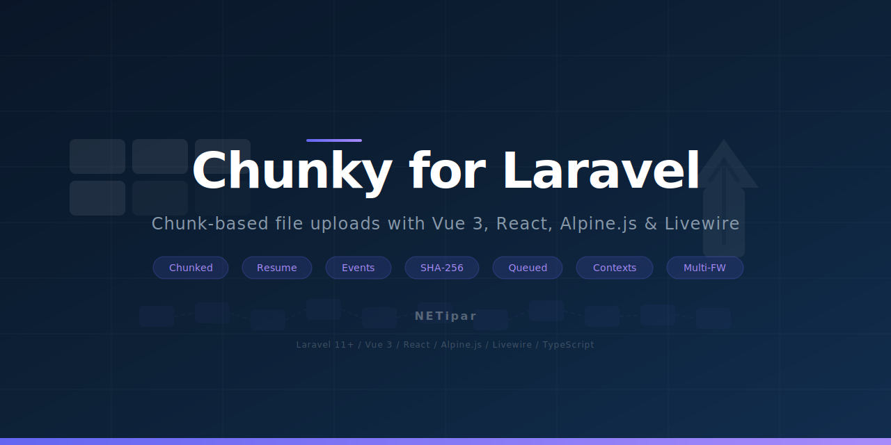

<picture>
  <source media="(prefers-color-scheme: dark)" srcset="art/banner.svg">
  
</picture>

# Chunky for Laravel

[](https://packagist.org/packages/netipar/laravel-chunky)
[](https://github.com/NETipar/laravel-chunky/actions?query=workflow%3ATests+branch%3Amain)
[](https://packagist.org/packages/netipar/laravel-chunky)

Chunk-based file upload package for Laravel with event-driven architecture, resume support, and framework-agnostic frontend clients for **Vue 3**, **React**, **Alpine.js**, and **Livewire**. Upload large files reliably over unstable connections.

## Quick Example

```php
// Backend: Listen for completed uploads
// EventServiceProvider
protected $listen = [
    \NETipar\Chunky\Events\UploadCompleted::class => [
        \App\Listeners\ProcessUploadedFile::class,
    ],
];
```

```vue
<!-- Frontend: Vue 3 upload with progress -->
<script setup>
import { useChunkUpload } from '@netipar/chunky-vue3';

const { upload, progress, isUploading, pause, resume } = useChunkUpload();

function onFileChange(event) {
    upload(event.target.files[0]);
}
</script>

<template>
    <input type="file" @change="onFileChange" />
    <progress v-if="isUploading" :value="progress" max="100" />
    <button v-if="isUploading" @click="pause">Pause</button>
</template>
```

## Requirements

- PHP 8.2+
- Laravel 11 or 12

## Installation

### Backend

```bash
composer require netipar/laravel-chunky
```

Publish the config file:

```bash
php artisan vendor:publish --tag=chunky-config
```

Run the migrations (for database tracker):

```bash
php artisan migrate
```

### Frontend

Install the package for your framework:

```bash
# Vue 3
npm install @netipar/chunky-vue3

# React
npm install @netipar/chunky-react

# Alpine.js (standalone, without Livewire)
npm install @netipar/chunky-alpine

# Core only (framework-agnostic)
npm install @netipar/chunky-core
```

> The `@netipar/chunky-core` package is automatically installed as a dependency of all framework packages.

### Livewire

No npm package needed. The Livewire component uses Alpine.js under the hood and is included in the Composer package. Just add the component to your Blade template:

```blade
<livewire:chunky-upload />
```

## Frontend Packages

| Package | Framework | Peer Dependencies |
|---------|-----------|-------------------|
| `@netipar/chunky-core` | None (vanilla JS/TS) | - |
| `@netipar/chunky-vue3` | Vue 3.4+ | `vue` |
| `@netipar/chunky-react` | React 18+ / 19+ | `react` |
| `@netipar/chunky-alpine` | Alpine.js 3+ | - |

## Usage

### How It Works

1. **Frontend** initiates an upload with file metadata
2. **Backend** returns an `upload_id`, `chunk_size`, and `total_chunks`
3. **Frontend** slices the file and uploads chunks in parallel with SHA-256 checksums
4. **Backend** stores each chunk, verifies integrity, tracks progress
5. When all chunks arrive, an `AssembleFileJob` merges them on the queue
6. **Events** fire at each step -- hook in your own listeners

### API Endpoints

The package registers three routes (configurable prefix/middleware):

| Method | Endpoint | Purpose |
|--------|----------|---------|
| `POST` | `/api/chunky/upload` | Initiate upload |
| `POST` | `/api/chunky/upload/{uploadId}/chunks` | Upload a chunk |
| `GET` | `/api/chunky/upload/{uploadId}` | Get upload status |

### Vue 3

```vue
<script setup lang="ts">
import { useChunkUpload } from '@netipar/chunky-vue3';

const {
    progress, isUploading, isPaused, isComplete, error,
    uploadId, uploadedChunks, totalChunks, currentFile,
    upload, pause, resume, cancel, retry,
    onProgress, onChunkUploaded, onComplete, onError,
} = useChunkUpload({
    maxConcurrent: 3,
    autoRetry: true,
    maxRetries: 3,
    withCredentials: true,
});

function onFileChange(event: Event) {
    const input = event.target as HTMLInputElement;
    if (input.files?.[0]) {
        upload(input.files[0]);
    }
}
</script>

<template>
    <input type="file" @change="onFileChange" :disabled="isUploading" />
    <progress v-if="isUploading" :value="progress" max="100" />
</template>
```

### React

```tsx
import { useChunkUpload } from '@netipar/chunky-react';

function FileUpload() {
    const {
        progress, isUploading, isPaused, isComplete, error,
        upload, pause, resume, cancel, retry,
    } = useChunkUpload({ maxConcurrent: 3 });

    const handleChange = (e: React.ChangeEvent<HTMLInputElement>) => {
        const file = e.target.files?.[0];
        if (file) upload(file);
    };

    return (
        <div>
            <input type="file" onChange={handleChange} disabled={isUploading} />
            {isUploading && <progress value={progress} max={100} />}
            {isUploading && (
                <button onClick={isPaused ? resume : pause}>
                    {isPaused ? 'Resume' : 'Pause'}
                </button>
            )}
            {error && <p style={{ color: 'red' }}>{error}</p>}
        </div>
    );
}
```

### Alpine.js

```html
<script>
import { registerChunkUpload } from '@netipar/chunky-alpine';
import Alpine from 'alpinejs';

registerChunkUpload(Alpine);
Alpine.start();
</script>

<div x-data="chunkUpload({ maxConcurrent: 3 })">
    <input type="file" x-on:change="handleFileInput($event)" :disabled="isUploading" />

    <template x-if="isUploading">
        <div>
            <progress :value="progress" max="100"></progress>
            <span x-text="Math.round(progress) + '%'"></span>
            <button x-on:click="isPaused ? resume() : pause()" x-text="isPaused ? 'Resume' : 'Pause'"></button>
            <button x-on:click="cancel()">Cancel</button>
        </div>
    </template>

    <template x-if="error">
        <div>
            <span x-text="error"></span>
            <button x-on:click="retry()">Retry</button>
        </div>
    </template>
</div>
```

### Livewire

```blade
{{-- Basic usage --}}
<livewire:chunky-upload />

{{-- With context for validation --}}
<livewire:chunky-upload context="profile_avatar" />

{{-- With custom slot content --}}
<livewire:chunky-upload>
    <div class="my-custom-upload-ui">
        <input type="file" x-on:change="handleFileInput($event)" />
        <div x-show="isUploading">
            <progress :value="progress" max="100"></progress>
        </div>
    </div>
</livewire:chunky-upload>
```

Listen for the upload completion in your Livewire parent component:

```php
#[On('chunky-upload-completed')]
public function handleUpload(array $data): void
{
    // $data['uploadId'], $data['fileName'], $data['finalPath'], $data['disk']
}
```

### Core (Framework-agnostic)

```typescript
import { ChunkUploader } from '@netipar/chunky-core';

const uploader = new ChunkUploader({
    maxConcurrent: 3,
    autoRetry: true,
    maxRetries: 3,
    context: 'documents',
});

uploader.on('progress', (event) => {
    console.log(`${event.percentage}%`);
});

uploader.on('complete', (result) => {
    console.log('Done:', result.uploadId);
});

uploader.on('error', (error) => {
    console.error('Failed:', error.message);
});

await uploader.upload(file, { folder: 'reports' });

// Controls
uploader.pause();
uploader.resume();
uploader.cancel();
uploader.retry();

// Cleanup when done
uploader.destroy();
```

## Context-based Validation & Save Callbacks

Register per-context validation rules and save handlers in your `AppServiceProvider`:

```php
use NETipar\Chunky\Facades\Chunky;

public function boot(): void
{
    Chunky::context(
        'profile_avatar',
        rules: fn () => [
            'file_size' => ['max:5242880'], // 5MB
            'mime_type' => ['in:image/jpeg,image/png,image/webp'],
        ],
        save: function ($metadata) {
            $user = auth()->user();
            $user->addMediaFromDisk($metadata->finalPath, $metadata->disk)
                ->toMediaCollection('avatar');
        },
    );

    Chunky::context(
        'documents',
        rules: fn () => [
            'file_size' => ['max:104857600'], // 100MB
            'mime_type' => ['in:application/pdf,application/zip'],
        ],
    );
}
```

Then pass the context from the frontend:

```typescript
// Vue 3
const { upload } = useChunkUpload({ context: 'profile_avatar' });

// React
const { upload } = useChunkUpload({ context: 'profile_avatar' });

// Alpine.js
// <div x-data="chunkUpload({ context: 'profile_avatar' })">
```

## Listening to Events

Register listeners in your `EventServiceProvider`:

```php
use NETipar\Chunky\Events\UploadCompleted;
use NETipar\Chunky\Events\ChunkUploaded;
use NETipar\Chunky\Events\FileAssembled;

protected $listen = [
    UploadCompleted::class => [
        \App\Listeners\ProcessUploadedFile::class,
        \App\Listeners\NotifyUserAboutUpload::class,
    ],
    ChunkUploaded::class => [
        \App\Listeners\TrackUploadProgress::class,
    ],
];
```

Example listener:

```php
namespace App\Listeners;

use NETipar\Chunky\Events\UploadCompleted;
use Illuminate\Support\Facades\Storage;

class ProcessUploadedFile
{
    public function handle(UploadCompleted $event): void
    {
        $path = $event->finalPath;
        $disk = $event->disk;

        Storage::disk($disk)->move($path, "documents/{$event->uploadId}.zip");
    }
}
```

### Available Events

| Event | Payload | When |
|-------|---------|------|
| `UploadInitiated` | uploadId, fileName, fileSize, totalChunks | Upload initialized |
| `ChunkUploaded` | uploadId, chunkIndex, totalChunks, progress% | After each successful chunk |
| `ChunkUploadFailed` | uploadId, chunkIndex, exception | On chunk error |
| `FileAssembled` | uploadId, finalPath, disk, fileName, fileSize | After file assembly |
| `UploadCompleted` | uploadId, finalPath, disk, metadata | Full upload complete |

## Using the Facade

```php
use NETipar\Chunky\Facades\Chunky;

// Register a context
Chunky::context('documents', rules: fn () => [...], save: fn ($metadata) => ...);

// Programmatic initiation
$result = Chunky::initiate('large-file.zip', 524288000, 'application/zip');
// Returns: ['upload_id' => '...', 'chunk_size' => 1048576, 'total_chunks' => 500]

// Query upload status (returns UploadMetadata DTO)
$status = Chunky::status($uploadId);
// $status->progress(), $status->fileName, $status->status, etc.
```

## Configuration

Key `.env` variables:

```
CHUNKY_TRACKER=database
CHUNKY_DISK=local
CHUNKY_CHUNK_SIZE=1048576
```

Full `config/chunky.php`:

| Key | Default | Description |
|-----|---------|-------------|
| `tracker` | `database` | Tracking driver: `database` or `filesystem` |
| `disk` | `local` | Laravel filesystem disk for storage |
| `chunk_size` | `1048576` (1MB) | Chunk size in bytes |
| `temp_directory` | `chunky/temp` | Temp directory for chunks |
| `final_directory` | `chunky/uploads` | Directory for assembled files |
| `expiration` | `1440` | Upload expiration in minutes (24h) |
| `max_file_size` | `0` | Max file size in bytes (0 = unlimited) |
| `allowed_mimes` | `[]` | Allowed MIME types (empty = all) |
| `routes.prefix` | `api/chunky` | Route prefix |
| `routes.middleware` | `['api']` | Route middleware |
| `verify_integrity` | `true` | SHA-256 checksum verification |
| `auto_cleanup` | `true` | Auto-cleanup expired uploads |

## Tracking Drivers

### Database (default)

Uses the `chunked_uploads` table. Best for production -- queryable, reliable, supports status tracking.

```
CHUNKY_TRACKER=database
```

### Filesystem

Uses JSON metadata files on disk. Zero database dependency -- useful for simple setups.

```
CHUNKY_TRACKER=filesystem
```

## Error Handling

```php
use NETipar\Chunky\Exceptions\ChunkyException;
use NETipar\Chunky\Exceptions\ChunkIntegrityException;
use NETipar\Chunky\Exceptions\UploadExpiredException;

try {
    $manager->uploadChunk($uploadId, $chunkIndex, $file);
} catch (ChunkIntegrityException $e) {
    // SHA-256 checksum mismatch
} catch (UploadExpiredException $e) {
    // Upload has expired (past 24h default)
} catch (ChunkyException $e) {
    // Base exception (catches all above)
}
```

## Examples

- [English examples](examples/en/)
- [Magyar peldak](examples/hu/)

## Testing

```bash
composer test
```

## Credits

- [NETipar](https://netipar.hu)

## License

The MIT License (MIT). Please see [License File](LICENSE.md) for more information.
