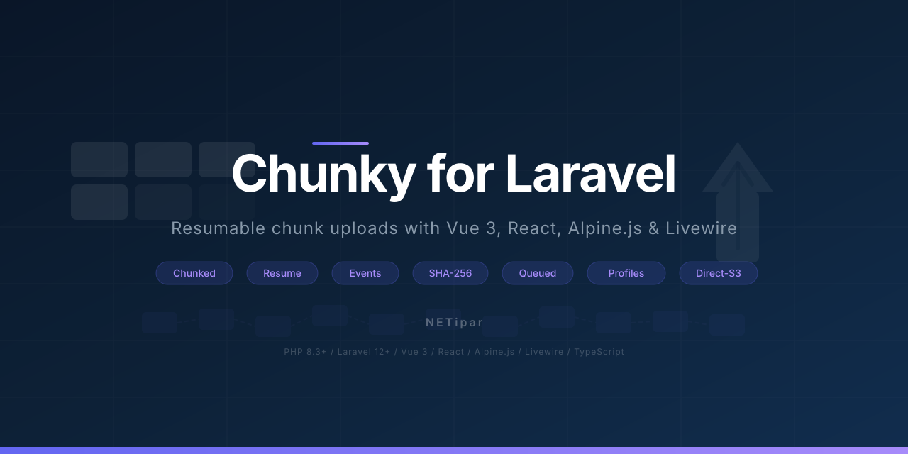

<picture>
  <source media="(prefers-color-scheme: dark)" srcset="art/banner.svg">
  
</picture>

# Chunky for Laravel

[](https://packagist.org/packages/netipar/laravel-chunky)
[](https://github.com/NETipar/laravel-chunky/actions?query=workflow%3ATests)
[](https://packagist.org/packages/netipar/laravel-chunky)

Resumable, chunk-based file uploads for Laravel — upload large files reliably over flaky connections. A small, typed backend built on **ports & adapters**, and a framework-agnostic frontend engine with first-class wrappers for **Vue 3**, **React**, **Alpine.js**, and **Livewire**.

Works out of the box with **no queue worker and no broadcasting** — the direct upload response already carries the result. Turn those on later for scale.

> **v1.0 is a ground-up rewrite.** Coming from `0.x`? See [UPGRADE.md](UPGRADE.md).

## Contents

- [Why Chunky](#why-chunky)
- [Requirements](#requirements)
- [5-minute quickstart](#5-minute-quickstart)
- [How it works](#how-it-works)
- [Upload profiles](#upload-profiles)
- [Frontend](#frontend)
- [Assembly modes (sync / queue / auto)](#assembly-modes)
- [Batch uploads](#batch-uploads)
- [Authorization](#authorization)
- [Events & broadcasting](#events--broadcasting)
- [Errors](#errors)
- [Console commands](#console-commands)
- [Configuration](#configuration)

## Why Chunky

- **Resumable.** Chunks are tracked server-side; a reload resumes the same upload via a file fingerprint instead of re-sending bytes.
- **Navigation-proof.** On the frontend, uploads are owned by a module-level manager — switching pages (SPA) doesn't cancel them.
- **Complete without infra.** In the default `auto` mode small files assemble in-request and the final response contains the file + your payload. No Echo, no worker required.
- **One state machine, two drivers.** Database or filesystem tracking sit behind the same contract, verified by the same test suite — no driver drift.
- **Typed end to end.** PHPStan level max on the backend, strict TypeScript on the frontend.

## Requirements

- PHP **8.3+**, Laravel **12 or 13**
- A queue worker only if you use `assembly.mode = queue` (or `auto` for files above the threshold)
- Broadcasting (Echo/Reverb) is entirely optional

## 5-minute quickstart

**1. Install the backend.**

```bash
composer require netipar/laravel-chunky
php artisan chunky:install   # publishes config + migrations
php artisan migrate
```

**2. Register an upload profile** — where files go and what to do when they finish. In a service provider:

```php
use NETipar\Chunky\Facades\Chunky;

Chunky::simple('avatars', 'avatars', ['max_size' => 10 * 1024 * 1024, 'mimes' => ['image/jpeg', 'image/png']]);
```

For real logic (e.g. creating a Media record), generate a class:

```bash
php artisan make:chunky-profile AvatarProfile
```

```php
use NETipar\Chunky\Profiles\CompletedUpload;
use NETipar\Chunky\Profiles\UploadContext;
use NETipar\Chunky\Profiles\UploadProfile;

class AvatarProfile extends UploadProfile
{
    public function rules(): array
    {
        return ['file_size' => ['max:10485760'], 'mime_type' => ['in:image/jpeg,image/png']];
    }

    public function directory(UploadContext $context): string
    {
        return "avatars/{$context->userId()}";
    }

    public function authorize(UploadContext $context): bool
    {
        return $context->user !== null;
    }

    public function completed(CompletedUpload $upload): array
    {
        $media = Media::create(['disk' => $upload->disk, 'path' => $upload->path, 'user_id' => $upload->userId]);

        return ['media_id' => $media->id]; // becomes the response `payload`
    }
}
```

Register it in `config/chunky.php`:

```php
'profiles' => ['avatar' => \App\Chunky\Profiles\AvatarProfile::class],
```

**3. Upload from the frontend.**

```bash
npm install @netipar/chunky-core
```

```ts
import { manager, configure } from '@netipar/chunky-core';

configure({
    baseUrl: '/api/chunky',
    headers: { 'X-CSRF-TOKEN': document.querySelector('meta[name=csrf-token]')!.getAttribute('content')! },
});

const uploader = manager.upload(file, { profile: 'avatar' });

uploader.subscribe((state) => {
    console.log(state.status, state.progress, state.etaSeconds);
});

const result = await uploader.upload(); // resolves once assembled
console.log(result.file?.url, result.payload?.media_id);
```

That's it — no worker, no broadcasting. Files up to 256 MB assemble in the request and the result comes straight back.

## How it works

```
initiate ──▶ upload chunks (concurrent, retried) ──▶ assemble ──▶ completed
   POST /upload          POST /upload/{id}/chunks         (sync or queued)
```

1. **Initiate** returns an `upload_id`, `chunk_size`, and `total_chunks`. If a matching fingerprint is found, it resumes an existing upload instead.
2. The client uploads chunks concurrently, retrying transient failures.
3. On the final chunk the server **assembles** the file (streaming, never loading it all into memory), runs your profile's `completed()` hook, and — in sync mode — returns the result inline.

The full wire protocol is documented in [`docs/en/protocol.md`](docs/en/protocol.md) ([magyarul](docs/hu/protocol.md)) and [`docs/openapi.yaml`](docs/openapi.yaml).

## Upload profiles

A profile is the single place that decides validation, destination, authorization, and the post-assembly hook. Two ways to define one:

- **`Chunky::simple($name, $directory, $options)`** — a fixed directory + optional `max_size` / `mimes`.
- **A class extending `UploadProfile`** — override `rules()`, `disk()`, `directory()`, `authorize()`, `fileName()`, `completed()`, `maxFileSize()`.

The batch member endpoint validates against the **batch's** profile, so a client can't smuggle in a more permissive one.

## Frontend

All wrappers are thin adapters over `@netipar/chunky-core`. The golden rule: **a component unmounting only unsubscribes — it never cancels the upload.** The upload lives in the manager and survives navigation.

### Core (any framework)

```ts
import { manager, configure, Uploader } from '@netipar/chunky-core';

const uploader = manager.upload(file, { profile: 'avatar' });
uploader.on('completed', (result) => { /* ... */ });
uploader.on('failed', (error) => console.error(error.code, error.message));

uploader.pause();
uploader.resume();
await uploader.cancel();

// Warn on real page unload while uploads are active (SPA nav is unaffected):
manager.installUnloadGuard();
```

`uploader.getState()` returns an immutable snapshot: `{ status, progress, uploadedChunks, totalChunks, bytesPerSecond, etaSeconds, file, result, error }`.

For image uploads, `uploader.previewUrl()` lazily creates a cached object URL you can drop into an `` (null for non-image files); the manager revokes it when the upload is evicted via `manager.remove()`. Need a real downscaled thumbnail instead? `await createThumbnail(file, { maxDimension: 256 })` returns a `Blob` (WebP by default), dependency-free.

Want end-to-end verification? `manager.upload(file, { profile: 'avatar', fileChecksum: true })` hashes the whole file (SHA-256, dependency-free) in parallel with the upload and the server verifies the assembled result against it.

### Vue 3 — `@netipar/chunky-vue3`

```ts
import { createChunky } from '@netipar/chunky-vue3';

app.use(createChunky({ baseUrl: '/api/chunky', headers: { 'X-CSRF-TOKEN': token } }));
```

```vue
<script setup lang="ts">
import { useUpload } from '@netipar/chunky-vue3';

const { start, state, previewUrl } = useUpload();
const onPick = (e: Event) => start((e.target as HTMLInputElement).files![0], { profile: 'avatar' });
</script>

<template>
  <input type="file" @change="onPick" />
  
  <progress v-if="state" :value="state.progress" max="100" />
</template>
```

`useUploads()` gives a reactive list of all active uploads (for a global tray); `UploadTray` and `ChunkDropzone` are headless components you can style.

### React — `@netipar/chunky-react`

```tsx
import { ChunkyProvider, useUpload } from '@netipar/chunky-react';

function Uploader() {
    const { start, state } = useUpload();
    return (
        <>
            <input type="file" onChange={(e) => start(e.target.files![0], { profile: 'avatar' })} />
            {state && <progress value={state.progress} max={100} />}
        </>
    );
}

// <ChunkyProvider config={{ baseUrl: '/api/chunky', headers: { 'X-CSRF-TOKEN': token } }}>…</ChunkyProvider>
```

### Alpine.js — `@netipar/chunky-alpine`

```ts
import { registerChunky } from '@netipar/chunky-alpine';
Alpine.plugin((Alpine) => registerChunky(Alpine, { baseUrl: '/api/chunky' }));
```

```html
<div x-data="chunkyUpload({ profile: 'avatar' })">
    <input type="file" @change="onFileChange($event)" />
    <template x-if="state"><progress :value="state.progress" max="100"></progress></template>
</div>
```

### Livewire

`composer require livewire/livewire`, register the Alpine component as above, then drop in the widget:

```blade
<livewire:chunky-upload profile="avatar" />
```

## Assembly modes

`config('chunky.assembly.mode')` — `auto` (default), `sync`, or `queue`.

| Mode | Final chunk response | Needs a worker? |
|---|---|---|
| `sync` | `{"status":"completed", "file":…, "payload":…}` | No |
| `queue` | `{"status":"assembling"}` — client polls status | Yes |
| `auto` | `sync` under `assembly.sync_threshold` (256 MB), else `queue` | Only for large files |

The frontend `await uploader.upload()` resolves with the final result in **all** modes — it polls automatically when assembly is queued.

## Batch uploads

```ts
const batch = manager.batch([file1, file2, file3], { profile: 'gallery', concurrency: 3 });
batch.subscribe((s) => console.log(`${s.completed}/${s.total}`));
const result = await batch.upload(); // { status: 'completed' | 'partially_completed' | 'cancelled', results }
```

Cancelling a batch cancels every non-terminal member on **any** tracker driver.

## Authorization

Uploads are owned by the authenticating user. Non-owners are answered with **404** on status/cancel (so upload ids can't be enumerated) and **403** on chunk POST. Anonymous uploads stay open for backward compatibility. Swap the `Authorizer` in `config/chunky.php` to customize.

## Events & broadcasting

Eleven events fire through the lifecycle (`UploadInitiated`, `ChunkUploaded`, `UploadCompleted`, `BatchCompleted`, …). Listen to them like any Laravel event.

Broadcasting is **off by default** (`broadcasting.enabled`). When enabled, payloads are sanitized (`disk`, `final_path`, `user_id` never leave the server) and versioned (`{"v":1,…}`). High-frequency events (`ChunkUploaded`, …) are excluded by default so turning it on only pushes the useful completion events.

## Errors

Every non-2xx response is a machine-readable envelope:

```json
{ "error": { "code": "upload_expired", "message": "The upload has expired." } }
```

The frontend surfaces this as a typed `ChunkyError` with a stable `.code` (`validation_failed`, `unauthorized`, `upload_not_found`, `invalid_state`, `checksum_mismatch`, `lock_timeout`, …). Retry decisions use the code, never the message. Full table in [`docs/en/protocol.md`](docs/en/protocol.md).

## Console commands

| Command | What it does |
|---|---|
| `chunky:install` | Publish config + migrations |
| `chunky:doctor` | Live health checks: disks, queue worker probe (`--wait=5`), broadcast driver, locking, tracker — exits non-zero on errors (CI/deploy gate) |
| `chunky:cleanup` | Remove expired, unfinished uploads and their chunks (schedule it) |
| `make:chunky-profile` | Generate an `UploadProfile` class |

## Configuration

`config/chunky.php` is validated at boot into a typed `ChunkyConfig` — a bad value fails fast with the offending key. Full reference and deployment recipes in [`docs/en/configuration.md`](docs/en/configuration.md) ([magyarul](docs/hu/configuration.md)).

---

- [UPGRADE.md](UPGRADE.md) — migrating from `0.x`
- [CHANGELOG.md](CHANGELOG.md) — release history
- [SECURITY.md](.github/SECURITY.md) — supported versions and reporting
- [CONTRIBUTING.md](.github/CONTRIBUTING.md) — development setup

Licensed under the [MIT license](LICENSE.md).
